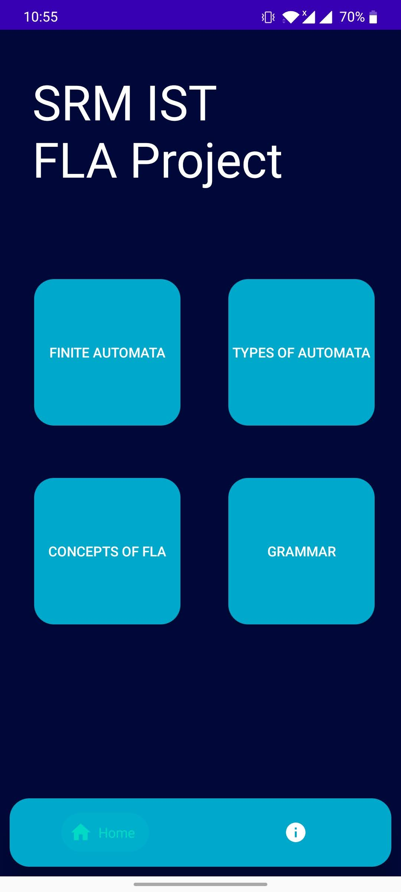
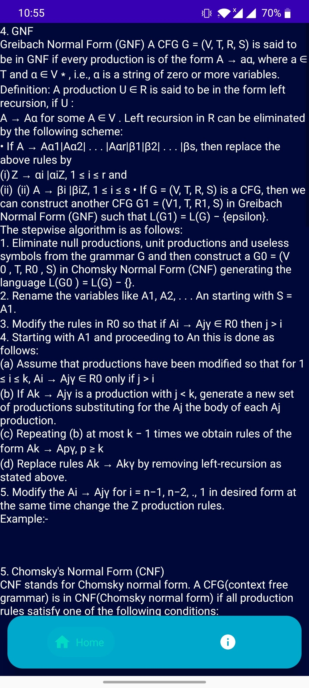
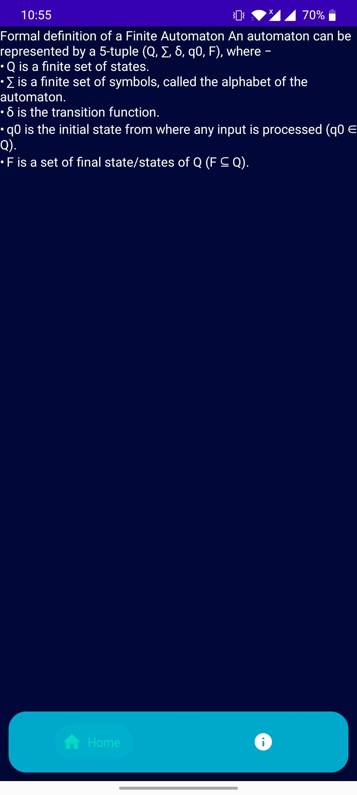
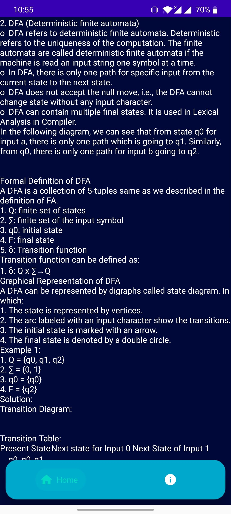
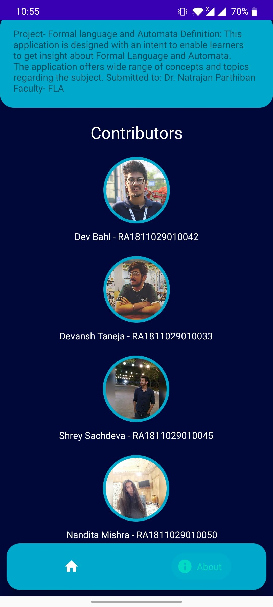

<h1 align="center">
  Formal Language and Automata
</h1>

> FLA concepts now live on your phone.

## Screenshots

## Load the application

Find the `fla.apk` in the releases tab, download it and run it on your phones.

## License 📜

See the `LICENSE` file for more info.

## Contributors 💥

Devansh Taneja - RA1811029010033 

Dev Bahl       - RA1811029010042 

Shrey Sachdeva - RA1811029010045 

Nandita Mishra - RA1811029010050 

